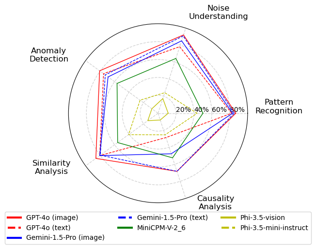
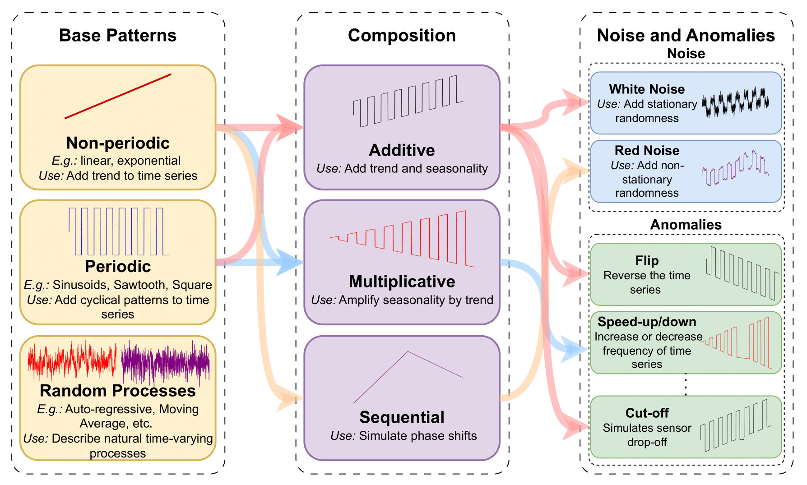

---
language:
- en
license: mit
size_categories:
- n<1K
task_categories:
- question-answering
pretty_name: timeseriesexam1
dataset_info:
  features:
  - name: question
    dtype: string
  - name: options
    sequence: string
  - name: answer
    dtype: string
  - name: question_type
    dtype: string
  - name: ts1
    sequence: float64
  - name: ts2
    sequence: float64
  - name: tid
    dtype: int64
  - name: difficulty
    dtype: string
  - name: format_hint
    dtype: string
  - name: relevant_concepts
    sequence: string
  - name: question_hint
    dtype: string
  - name: category
    dtype: string
  - name: subcategory
    dtype: string
  - name: id
    dtype: int64
  - name: ts
    sequence: float64
  splits:
  - name: test
    num_bytes: 8747183
    num_examples: 746
  download_size: 8920512
  dataset_size: 8747183
configs:
- config_name: default
  data_files:
  - split: test
    path: data/test-*
tags:
- Time-series
- LLMs
- GPT
- Gemini
- Phi
- Reasoning
- o3-mini
---

# Dataset Card for TimeSeriesExam-1

This dataset provides Question-Answer (QA) pairs for the paper [TimeSeriesExam: A Time Series Understanding Exam](https://arxiv.org/pdf/2410.14752). Example inference code can be found [here](https://github.com/moment-timeseries-foundation-model/TimeSeriesExam).

## 📖Introduction
Large Language Models (LLMs) have recently demonstrated a remarkable ability to model time series data. These capabilities can be partly explained if LLMs understand basic time series concepts. However, our knowledge of what these models understand about time series data remains relatively limited. To address this gap, we introduce TimeSeriesExam, a configurable and scalable multiple-choice question exam designed to assess LLMs across five core time series understanding categories: pattern recognition, noise understanding, similarity analysis, anomaly detection, and causality analysis.

<div align="center">


Figure. 1: Accuracy of latest LLMs on the `TimeSeriesExam.` Closed-source LLMs outperform open-source ones in simple understanding tasks, but most models struggle with complex reasoning tasks.

</div>

Time series in the dataset are created from a combination of diverse baseline Time series objects. The baseline objects cover linear/non-linear signals and cyclic patterns. 

<div align="center">


Figure. 2: The pipeline enables diversity by combining different components to create numerous synthetic time series with varying properties.

</div>

## Citation

If you find this work helpful, please consider citing our paper:

```
@inproceedings{caitimeseriesexam,
  title={TimeSeriesExam: A Time Series Understanding Exam},
  author={Cai, Yifu and Choudhry, Arjun and Goswami, Mononito and Dubrawski, Artur},
  booktitle={NeurIPS Workshop on Time Series in the Age of Large Models}
}
```

## Changelog
### [v1.1] - 2025-03-12

**Enhancements:**
- Adjusted generation hyperparameters and templates to eliminate scenarios that might lead to ambiguous or incorrect responses.
- Improved data formatting for consistency.
- Updated time-series sample length to 1024 to capture more diverse and complex features.

**Updated Model Evaluations:**
- The following table shows the updated evaluation on models (tokenization method):
  | Model    | Tokenization Method | Accuracy |
  |----------|---------------------|----------|
  | gpt-4o   | image               | 75.2%    |
  | gpt-4o   | plain_text          | 51.7%    |
  | 4o-mini  | plain_text          | 46.6%    |
  | o3-mini  | plain_text          | 59.0%    |

**Additional Information:**
- **Note:** The previous version ([v1.0](https://huggingface.co/datasets/AutonLab/TimeSeriesExam1/resolve/9f23771ca10d66607ee7abca0c5dcbae57349ac2/qa_dataset.json)) is still available for reference.
- **Research code for exam generation via templates is available on [GitHub](https://github.com/moment-timeseries-foundation-model/TimeSeriesExam/tree/exam_generation).**


## Liscense

MIT License

Copyright (c) 2024 Auton Lab, Carnegie Mellon University

Permission is hereby granted, free of charge, to any person obtaining a copy of this software and associated documentation files (the "Software"), to deal in the Software without restriction, including without limitation the rights to use, copy, modify, merge, publish, distribute, sublicense, and/or sell copies of the Software, and to permit persons to whom the Software is furnished to do so, subject to the following conditions:

The above copyright notice and this permission notice shall be included in all copies or substantial portions of the Software.

THE SOFTWARE IS PROVIDED "AS IS", WITHOUT WARRANTY OF ANY KIND, EXPRESS OR IMPLIED, INCLUDING BUT NOT LIMITED TO THE WARRANTIES OF MERCHANTABILITY, FITNESS FOR A PARTICULAR PURPOSE AND NONINFRINGEMENT. IN NO EVENT SHALL THE AUTHORS OR COPYRIGHT HOLDERS BE LIABLE FOR ANY CLAIM, DAMAGES OR OTHER LIABILITY, WHETHER IN AN ACTION OF CONTRACT, TORT OR OTHERWISE, ARISING FROM, OUT OF OR IN CONNECTION WITH THE SOFTWARE OR THE USE OR OTHER DEALINGS IN THE SOFTWARE.

See [MIT LICENSE](LICENSE) for details.


